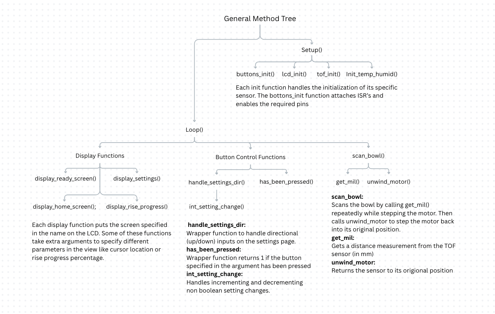
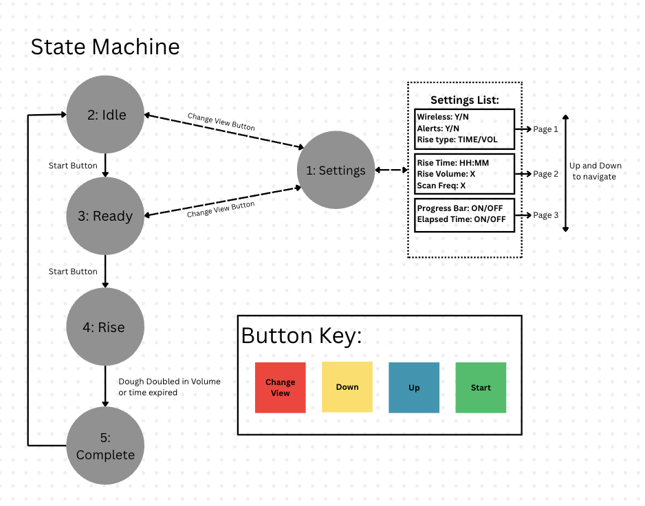
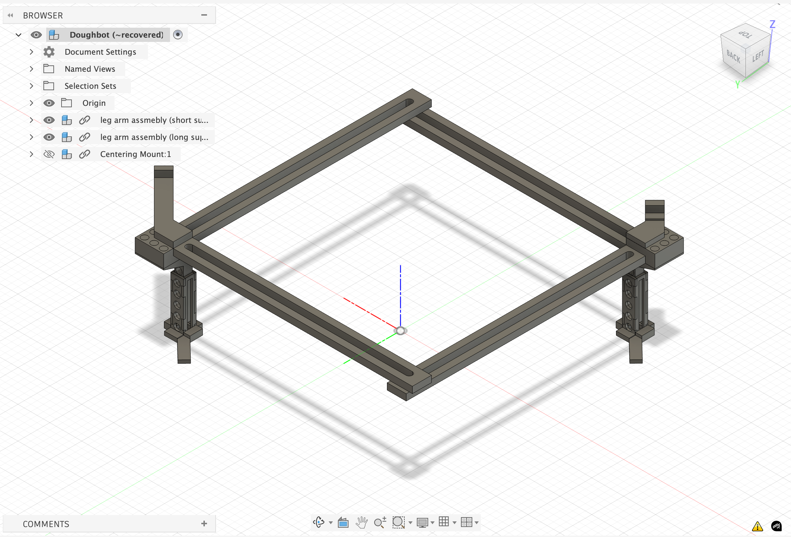
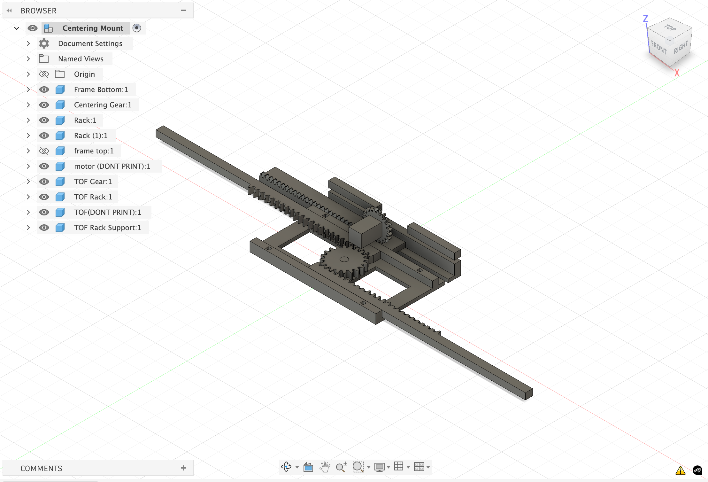
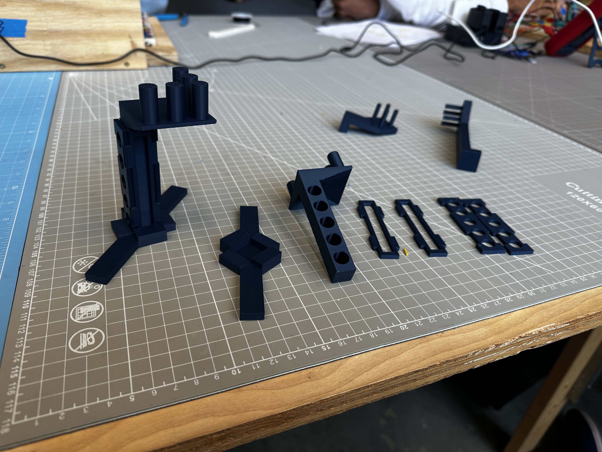
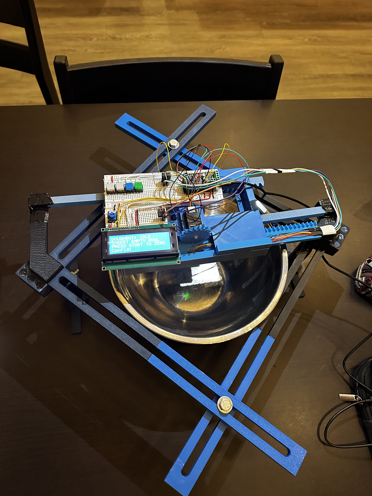
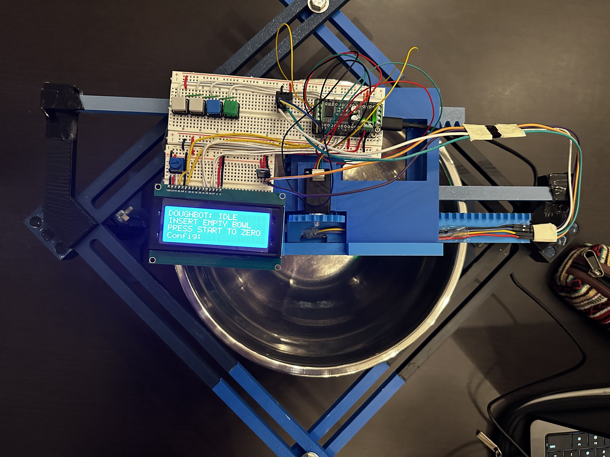
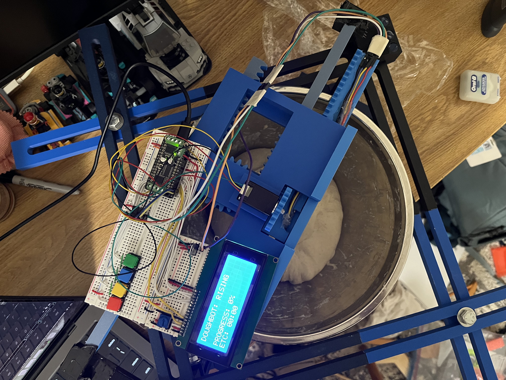
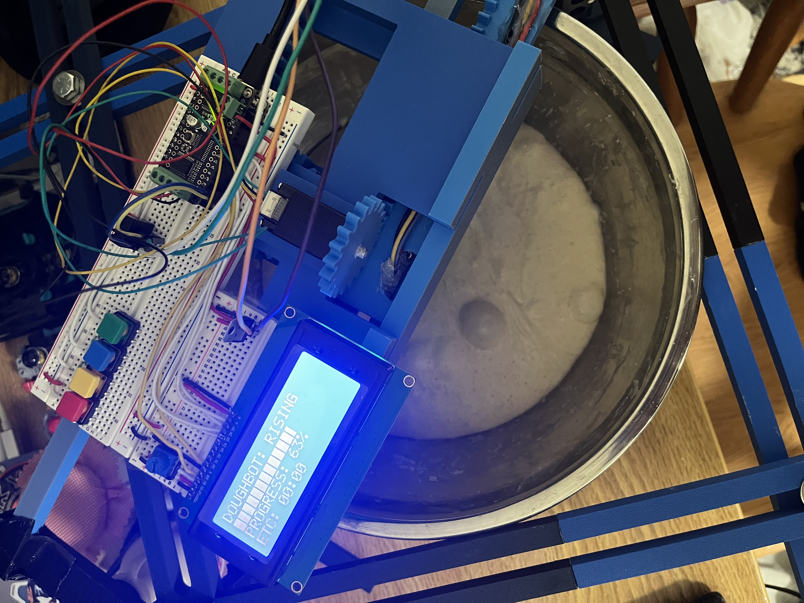

<link rel="stylesheet" href="style.css">

# Dough Bot

### Anna Kester & Grayson Wade

## Introduction

    
DoughBot was born out of a problem that troubles many bakers, specifically those tasked with letting dough rise. It can be difficult to visually determine when dough (in a standard concave bowl) has doubled in size, fundamentally undermining the precise nature of baking. Thus, we set forth to develop an embedded system that will measure when the dough has doubled in size and alert the baker of its status.

    
Existing solutions are almost exclusively for commercial baking applications <a href="#footnote-1">[1]</a>, or one home baking <em>smart</em> bowl "Crustello" has yet to come to fruition<a href="#footnote-2">[2]</a>.
    After a semester of learning about embedded systems and how MCUs interface with sensors to collect data, we chose to implement our project using a Time of Flight (TOF) sensor, stepper motor, and LCD screen – relying on concepts and skills such as I2C, PWM, development with Arduino and more!

## Methods

    <h4>Devices & Peripherals</h4>
    
<b>Adafruit HUZZAH32 - ESP32 Feather</b> We chose to use the ESP32 because of its small size, integration with FeatherWings, and options for WiFi capability. 
    <b>DC Motor + Stepper FeatherWing Add-on</b> This FeatherWing was the recommended Feather motor controller / motor shield for our stepper motor. It is extremely light, has a fully dedicated PWM driver chip, and handles all controls via I2C. Additionally, the pre-existing Arduino software library is an added benefit for ease of use. 
    <b>Mini Stepper Motor</b> We chose the mini stepper motor because of its small size, which is ideal due to the size and weight contrained nature of the physical stand supporting all components. 
    <b>Adafruit VL53L0X Time of Flight Distance Sensor</b> The VL53L0X has a ~30-1000mm range which is ideal for the scope of our project and well within the height range of a typical bowl used for allowing dough to rise. Communication is also done over I2C and there is an Arduino wrapper library for easy use with the ESP32 or other Arduino boards. 
    <b>Standard LCD 20x4</b> This standard white text on blue background LCD was chosen to display dough progress as well as other pertinent information. This LCD is the same as the one we used in class, so we knew communication with the display would be straightforward and in line with our needs for the project. 
    <b>DHT20 - AHT20 Temperature and Humidity Sensor</b> This sensor is another peripheral we tested in class and found suitable for our purposes. The simple I2C communication allows us to easily measure the temperature and humidity where the dough is rising – important metrics for devoted sourdough bakers. 

    <h4>Libraries</h4>
    
<b>Adafruit_VL53L0X</b> This library is the sensor driver that enables reading data from the VL53L0X TOF sensor. It is simple and abstracted for easy use. 
    <b>Adafruit_MotorShield</b> This library enables motor controls, communicating the number of steps and the port to the stepper motor. 
    <b>Adafruit_AHTX0</b> This library enables communication and reading from the temperature and humidity sensor. 
    <b>LiquidCrystal</b> This built-in library handles communication and writing to the LCD. 
    

    <h4>Code Logic</h4>
    

        
    

    <h5>Header files</h5>
    
Doughbot's source code is mostly broken into a number of header files that contain functions relating to specific libraries. The only two exceptions to this are Helper.h, which contains helper functions for a variety of files, and Buttons.h, that mostly contains the ISRs and a function to detect specific button presses.

    <h5>State Machine</h5>
    

        
    

    

        The DoughBot state machine is comprised of 5 states. States 1-4 are typical display states which help control the flow of the program. Each display state starts with a call to one of the display functions, followed by button handling logic. State 5 is a partially implemented finish state which simply prints to the console before returning to the home state (state 2). State 0 was reserved for a loading screen which has not been implemented. While slightly counter-intuative, the initial state is state 2 since state 1 is used for the settings. This is meant to make the logic a bit cleaner and be in line with the idea of not being able to go back a state, other than to reach the settings menu. The following is a detailed description of each state:
        <ol>
            <li>
                <h5>Settings</h5>
                
The Settings state can only be accessed by states 2 and 3 (via the red (Change View) button), and on completion (a secondary click of the red button) will return to the state it came from. The yellow (Down) and blue (Up) buttons can be used to navigate the Settings pages, and the green (Start / Select) button is used to toggle options. For non boolean options, pressing the start button will enter edit mode, denoted by a blinking cursor. In edit mode, the yellow and blue buttons can be used to update the value one digit at a time. To move to the next digit, press the green button. After setting the last digit, press the green button again to save the new value and exit edit mode. This state relies on the <b>display_settings</b> function to display the settings menu with the cursor in the right place. The handling of up, down, and start buttons was broken into separate functions due to their complexity.

            </li>
            <li>
                <h5>Idle</h5>
                
The Idle state is Doughbot's initial state, where it waits for the user to place the desired bowl (empty) inside. From this state, the user can either go to the settings or progress to the Ready state when the bowl has been placed, initiating the baseline scan of the empty bowl. The <b>display_home_screen()</b> function handles the screen display for this state. Button control was not split into another function because it is not very complicated. From this state, the user can view the ambient room temperature in Celsius. 

            </li>
            <li>
                <h5>Ready</h5>
                
The Ready state is the last state where the user can access the settings. At this point, Doughbot has scanned the empty bowl and is ready to begin the rise process. Like the Idle state, the user can only access the settings menu, or the next state. The <b>display_ready_screen</b> handles the screen display for this state. Button control was not split into another function because it is not very complicated. From this state, the user can view the ambient room temperature in Celsius.

            </li>
            <li>
                <h5>Rising</h5>
                
Once the Rising state has started, the user cannot leave this state until the dough is done rising (other than resetting the board). The settings menu is not accessible at this point for simplicity. Realistically, once the dough has started rising, there should not be a need to change any of the settings. If DoughBot is set to <em>Time mode</em>, the program will not scan the dough and will enter the Complete state when the timer (non-blocking software timer implemented with millis() function) expires. If DoughBot is set to the <em>Volume mode</em>, DoughBot will scan the dough at a frequency determined by the scan_freq setting (multiples of 10 minutes). DoughBot will enter the complete state only when the scanned volume is <em>x</em> times larger than its initial volume, where <em>x</em> is the "rise factor" setting. In both cases, the <b>display_rise_progress</b> function handles the screen display, allowing the user to see how close the dough is to being done.

            </li>
            <li>
                <h5>Complete</h5>
                
This state is currently not visible to the user. It simply prints a message to the console and returns to the start state. This state was created to handle alerting the user, but since that is not implemented, it is just a transitory state.

            </li>
        </ol>
    

    <h4>User Interface</h4>
    
Users can interact with the system via the LCD screen and four buttons. Starting from the user's far left, the red button (Change View) allows the user to access the system settings. Pressing the button again will return the user to their last screen. The settings are only accessible before a rise has been started. In the settings menu, the user can toggle the wireless connection*, alerts*, the elapsed rise time*, a rise progress bar, and select time or volume-based rise, desired rise time**, target rise volume**, and scan frequency in multiples of 10 minutes**. The next two buttons are the yellow (Down) and blue (Up) buttons, which allow the user to scroll through the menu and increment/decrement the 3 non-boolean fields. These buttons currently have no effect outside of the settings menu. The final button is the green (Start / Select) button. In the settings menu, this button will toggle boolean options and enter edit mode for non-boolean options. Outside of the settings menu, the start button allows the user to progress through the state machine. Aside from the settings menu, there is no way to return to a previous state.

('*' denotes incomplete options, '**' denotes a non boolean field)

    <h4>BOM</h4>
    <table style="margin-left: 40px;">
        <tr style="font-weight: bold;">
            <td>Part</td>
            <td>Price</td>
            <td>Vendor</td>
        </tr>
        <tr>
            <td><a href="https://www.adafruit.com/product/3317">Adafruit VL53L0X Time of Flight Distance</a></td>
            <td>$14.95</td>
            <td>Adafruit</td>
        </tr>
        <tr>
            <td><a href="https://www.adafruit.com/product/5396?srsltid=AfmBOopMHsuxksPDmVNcoLZCWIrgcbpCehMNrM5qmUyA9YXdC5VhLQc5">Adafruit VL53L4CD Time of Flight Distance Sensor - ~1 to 1300mm - STEMMA QT / Qwiic</a></td>
            <td>$14.95</td>
            <td>Adafruit</td>
        </tr>
        <tr>
            <td><a href="https://www.adafruit.com/product/4411">Mini Stepper Motor - 200 Steps - 20x30mm NEMA-8 Size</a></td>
            <td>$19.95</td>
            <td>Adafruit</td>
        </tr>
        <tr>
            <td><a href="https://www.adafruit.com/product/2927">DC Motor + Stepper FeatherWing Add-on For All Feather Boards</a></td>
            <td>$19.95</td>
            <td>Adafruit</td>
        </tr>
        <tr>
            <td><a href="https://www.adafruit.com/product/5183">DHT20 - AHT20 Pin Module - I2C Temperature and Humidity Sensor</a></td>
            <td>$4.50</td>
            <td>Adafruit</td>
        </tr>
        <tr>
            <td><a href="https://www.adafruit.com/product/198">Standard LCD 20x4 + extras - white on blue</a></td>
            <td>$17.95</td>
            <td>Adafruit</td>
        </tr>
        <tr>
            <td><a href="https://www.adafruit.com/product/1010">Colorful 12mm Square Tactile Button Switch Assortment - 15 pack</a></td>
            <td>$5.95</td>
            <td>Adafruit</td>
        </tr>
        <tr>
            <td><a href="https://www.adafruit.com/product/64">Half Sized Premium Breadboard - 400 Tie Points</a></td>
            <td>$4.95</td>
            <td>Adafruit</td>
        </tr>
        <tr>
            <td><a href="https://www.adafruit.com/product/5837">Premium Colorful Silicone Extension Jumper Wires - 200mm x 30 pc - Multi-Colored</a></td>
            <td>$9.95</td>
            <td>Adafruit</td>
        </tr>
        <tr>
            <td><a href="https://www.adafruit.com/product/5801">Vertical Wall Power Supply with USB C - 5V 3A Output and Switch</a></td>
            <td>$5.95</td>
            <td>Adafruit</td>
        </tr>
        <tr>
            <td><a href="https://www.adafruit.com/product/3972">USB Micro B Male Plug to 5-pin Terminal Block</a></td>
            <td>$6.50</td>
            <td>Adafruit</td>
        </tr>
        <tr>
            <td><a href="https://www.adafruit.com/product/239">Full Sized Premium Breadboard - 830 Tie Points</a></td>
            <td>From Vaccari</td>
            <td>Adafruit</td>
        </tr>
        <tr>
            <td>PLA Filament for 3D Printed Components</a></td>
            <td>From Makerspace</td>
            <td>?</td>
        </tr>
        <tr style="font-weight: bold;">
            <td>Total</td>
            <td>$125.55</td>
            <td> </td>
        </tr>
    </table>
    
<b>3D Printed Components</b>

    

        
        
    

    

        
        
    

## Results

    
Once the stand is fitted to the size of the bowl, the user first zeroes the bowl by running a measurement along the empty bowl. A plastic / non-reflective bowl is preferred since a metal bowl creates too much reflection for the TOF sensor to accurately read measurements. Then, dough is placed in the bowl and the user initiates the rise cycle by taking a baseline dough measurement and defining the scan frequency they desire, along with any additional settings. Whenever the user checks on their dough, they can view the rise progress bar to monitor whether their dough has doubled in size, or check the time elapsed in in Time mode.

    

        
        
    

    

        
        
    

    

## Accessibility

    
Using DoughBot requires the ability to adjust the stand and centering mechanism around the bowl, push buttons, and read the display. This current design may be difficult for people with limited use of their hands or vision problems.  To make our ES more accessible we would work to transmit the data displayed on the LCD to a web server where users can then use a screen reader to receive updates on the status of their dough. Other changes we could implement in the future to improve accessibility include designing a more simple case / stand for the device to be housed in and then attached to the user's bowl, including language settings, and considering challenges that might face those who are color-blind. One potential challenge for those with blue-green colorblindness is that the "start" button is green and the "up" button is blue, possibly causing confusion if not labeled or explicitly identified otherwise.
 

## Ethical Implications

    
Given that our device does not stream any data, we find few ethical issues. If data were to be streamed to a web server, this would introduce data privacy and security concerns. Furthermore, our device does not collect any personal information or store any data collected via the TOF or temperature/humidity sensors.

## Schedule

 
    

         
        <h5><u>Original Schedule</u></h5>
        <table>
            <tr>
                <td>Oct. 24th</td>
                <td>Proposal Due 
                    <ul>
                        <li>Finalize materials</li>
                        <li>Find drivers for sensors</li>
                        <li>Finalize device design</li>
                    </ul>
                </td>
            </tr>
            <tr>
                <td>Week of Nov 3rd</td>
                <td>
                    <ul>
                        <li>Connect sensors and read data</li>
                        <li>Start writing bowl scanning logic</li>
                    </ul>
                </td>
            </tr>
            <tr>
                <td>Week of Nov 10th</td>
                <td>
                    <ul>
                        <li>Motor assembly</li>
                        <li>Integrate sensors</li>
                        <li>Make adjustments to 3D prints</li>
                    </ul>
                </td>
            </tr>
            <tr>
                <td>Week of Nov 17th</td>
                <td>
                    <ul>
                        <li>Measure volume</li>
                        <li>Assemble stand</li>
                    </ul>
                </td>
            </tr>
            <tr>
                <td>Week of Nov 24th (Thanksgiving)</td>
                <td>
                    <ul>
                        <li>User interface implementation</li>
                        <li>Optional software feature / dough prediction</li>
                    </ul>
                </td>
            </tr>
            <tr>
                <td>Week of Dec 1st</td>
                <td>
                    <ul>
                        <li>Finalize integration</li>
                        <li>Work on presentation and website</li>
                    </ul>
                </td>
            </tr>
            <tr>
                <td>Finals Week</td>
                <td>
                    <ul>
                        <li>Finish</li>
                    </ul>
                </td>
            </tr>
        </table>
    

    

         
        <h5><u>Actual Schedule</u></h5>
        <table>
            <tr>
                <td>Oct. 24th</td>
                <td>Proposal Due
                    <ul>
                        <li>Finalized materials</li>
                        <li>Finalized functional design</li>
                        <li>Began 3D printing</li>
                    </ul>
                </td>
            </tr>
            <tr>
                <td>Week of Nov 3rd</td>
                <td>
                    <ul>
                        <li>Have software drivers ready to go</li>
                        <li>Test components (individual)</li>
                        <li>Rough stand design</li>
                    </ul>
                </td>
            </tr>
            <tr>
                <td>Week of Nov 10th</td>
                <td>
                    <ul>
                        <li>Finished 3D prints</li>
                    </ul>
                </td>
            </tr>
            <tr>
                <td>Week of Nov 17th</td>
                <td>
                    <ul>
                        <li>Started writing base code</li>
                        <li>Started testing sensors</li>
                        <li>Testing motor</li>
                    </ul>
                </td>
            </tr>
            <tr>
                <td>Week of Nov 24th (Thanksgiving)</td>
                <td>
                    <ul>
                        <li>Wrote volume calculation code</li>
                        <li>Continued writing motor & display code</li> 
                    </ul>
                </td>
            </tr>
            <tr>
                <td>Week of Dec 1st</td>
                <td>
                    <ul>
                        <li>Assembled stand and centering mount</li>
                        <li>Started website</li>
                    </ul>
                </td>
            </tr>
            <tr>
                <td>Finals Week</td>
                <td>
                    <ul>
                        <li>Finish</li>
                    </ul>
                </td>
            </tr>
        </table>
    

## Issues

    
Over the course of the project we encounted a number of issues which are ennumerated below with our corresponding resolutions.

    <table style="margin-left: 40px;">
        <tr style="font-weight: bold;">
            <td>Issue</td>
            <td>Resolution</td>
        </tr>
        <tr>
            <td>Our 3D prints were designed with no tolerances so pieces did not fit together.</td>
            <td>We reprinted some pieces. Others were shaved down with a knife, drill, or sandpaper.</td>
        </tr>
        <tr>
            <td>The breadboard we ordered was half-sized and didn't comfortable fit all our components.</td>
            <td>We are borrowing a full-size breadboard from Professor Vaccari.</td>
        </tr>
        <tr>
            <td>The motor was slipping not allowing the gear to effectively push the rack holding the TOF sensor.</td>
            <td>We super glued the gear to the motor.</td>
        </tr>
        <tr>
            <td>The TOF sensor would not run on the same bus as the motor.</td>
            <td>The TOF sensor is now getting power and ground from a different source, alleviating the issue.</td>
        </tr>
        <tr>
            <td>The LCD requires 5V which we had not accounted for initially.</td>
            <td>We were able to power it up with 5V but drive it from the logic pins of the ESP32.</td>
        </tr>
    </table>

## Future Work

    
If we had more time to work on our project, there are a number of changes and improvements we would like to make.
        <ul>
            <li>Redesign the stand to instead attach directly to the bowl, expanding the range of bowls accommodated.</li>
            <li>Develop a web server to wirelessly stream dough progress and other updates to a user's PC or mobile device.</li>
            <li>Implement alerts to notify the user when their dough has doubled in size, or at other progress points along the rise.</li>
            <li>Design an alternate method of interacting with the device to increase accessibility.</li>
        </ul>
    

## References

    
 [1] “Dough Processing Sensors | KEYENCE America,” accessed December 7, 2025, https://www.keyence.com/products/measure/industries/food-and-beverage/dough-processing-sensors.jsp.

    
 [2] “Crustello: Smart AI Dough & Sourdough Tracker,” Kickstarter, March 1, 2026, https://www.kickstarter.com/projects/racebox/crustello.

    
[3] Ada, Lady. “Overview | Adafruit HUZZAH32 - ESP32 Feather | Adafruit Learning System.” Accessed December 10, 2025. https://learn.adafruit.com/adafruit-huzzah32-esp32-feather/overview.

    
[4] Ada, Lady. “Overview | Adafruit Stepper + DC Motor FeatherWing | Adafruit Learning System.” Accessed December 10, 2025. https://learn.adafruit.com/adafruit-stepper-dc-motor-featherwing/overview.

    
[5] Ada, Lady. “Overview | Adafruit VL53L0X Time of Flight Micro-LIDAR Distance Sensor Breakout | Adafruit Learning System.” Accessed December 10, 2025. https://learn.adafruit.com/adafruit-vl53l0x-micro-lidar-distance-sensor-breakout/overview.

    
[6] Industries, Adafruit. “Mini Stepper Motor - 200 Steps - 20x30mm NEMA-8 Size.” Accessed December 10, 2025. https://www.adafruit.com/product/4411.

    
[7] Rembor, Kattni. “Overview | Adafruit AHT20 Temperature & Humidity Sensor | Adafruit Learning System.” Accessed December 10, 2025. https://learn.adafruit.com/adafruit-aht20/overview.

